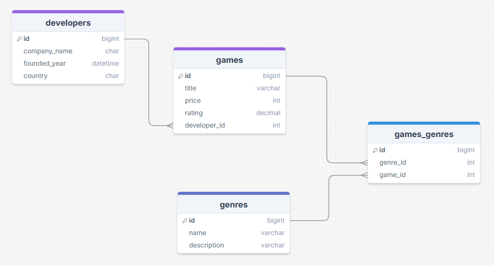

# Yetgim_gamevault_calisma
 Yetgim İş Zekası- Power BI, Tableau eğitimi kapsamında SQL veritabanı çalışması.
# GameVault Database Project

Digital oyun dağıtım platformu (Steam/Epic Games benzeri) veritabanı tasarımı.

## Proje Hakkında

Bu proje, oyun geliştiricileri, oyunlar ve türler arasındaki ilişkileri yöneten bir veritabanı sistemidir.

## Veritabanı Yapısı

### Tablolar

1. **developers** - Oyun geliştirici firmalar
2. **games** - Oyunlar
3. **genres** - Oyun türleri
4. **games_genres** - Oyun-tür ilişkisi (Many-to-Many)

### İlişkiler

- `developers` → `games` (1-to-Many)
- `games` ↔ `genres` (Many-to-Many via `games_genres`)

## 📊 Diyagram

## Kullanılan Teknolojiler

- PostgreSQL / MySQL

## İçerikler

-  CRUD işlemleri
-  Foreign Key ilişkileri
-  JOIN sorguları
-  UPDATE/DELETE operasyonları
-  Veri filtreleme ve sıralama

## Geliştirici

**Merve Atiş**  
Proje Tarihi: 18 Aralık 2024

Bu proje eğitim amaçlıdır.
